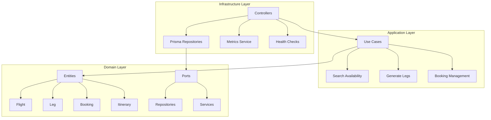

# Flight Service - Sistema de Gestão de Voos e Reservas

> **Teste Técnico - Engenheiro(a) de Software Sênior (Back-end)**
>
> Sistema back-end para gestão de voos, itinerários e reservas, implementado com Clean Architecture/Hexagonal, aplicando princípios SOLID e entregando CI/CD funcional.

## 📋 Índice

- [Arquitetura](#-arquitetura)
- [Tecnologias](#-tecnologias)
- [Funcionalidades](#-funcionalidades)
- [Instalação e Execução](#-instalação-e-execução)
- [Documentação da API](#-documentação-da-api)
- [Testes](#-testes)
- [CI/CD](#-cicd)
- [Observabilidade](#-observabilidade)
- [Decisões de Design](#-decisões-de-design)
- [Exemplos de Uso](#-exemplos-de-uso)

## 🏗️ Arquitetura

### Clean Architecture / Hexagonal

O projeto foi implementado seguindo os princípios da **Clean Architecture** com separação clara de responsabilidades:



### Estrutura de Pastas

```
src/
├── domain/                 # Camada de Domínio (Core Business)
│   ├── *.entity.ts        # Entidades de negócio
│   └── ports/             # Interfaces (Dependency Inversion)
├── application/           # Camada de Aplicação (Use Cases)
│   ├── search-availability.usecase.ts
│   └── generate-legs.usecase.ts
└── infrastructure/        # Camada de Infraestrutura (Adapters)
    ├── adapters/          # Controllers HTTP
    ├── repositories/      # Implementações Prisma
    ├── metrics/          # Observabilidade
    └── prisma/           # Configuração DB
```

### Princípios SOLID Aplicados

- **SRP**: Cada classe tem uma única responsabilidade
- **OCP**: Extensível através de interfaces e estratégias
- **LSP**: Substituição transparente de implementações
- **ISP**: Interfaces específicas e coesas
- **DIP**: Dependência de abstrações, não de implementações

## 🚀 Tecnologias

- **[NestJS](https://nestjs.com/)** - Framework backend robusto
- **[TypeScript](https://www.typescriptlang.org/)** - Tipagem estática
- **[Prisma](https://www.prisma.io/)** - ORM type-safe
- **[PostgreSQL](https://www.postgresql.org/)** - Banco de dados relacional
- **[Redis](https://redis.io/)** - Cache e idempotência
- **[Docker](https://www.docker.com/)** - Containerização
- **[Prometheus](https://prometheus.io/)** - Métricas
- **[Grafana](https://grafana.com/)** - Visualização
- **[Jest](https://jestjs.io/)** - Framework de testes

## ✨ Funcionalidades

### Modelagem de Dados

- **Airline**: Companhias aéreas com código IATA
- **Airport**: Aeroportos com timezone IANA
- **Flight**: Voos recorrentes (templates)
- **Leg**: Instâncias datadas de voos com capacidade
- **Itinerary**: Coleção de legs para viagens multi-trecho
- **Booking**: Reservas com controle de concorrência

### Endpoints Principais

#### 🛫 Flights (Templates de Voo)

```http
GET    /flights                    # Listar voos
POST   /flights                    # Criar voo
GET    /flights/{id}               # Obter voo específico
PUT    /flights/{id}               # Atualizar voo
DELETE /flights/{id}               # Remover voo
```

#### 📅 Legs (Instâncias Datadas)

```http
GET    /legs                       # Listar legs disponíveis
GET    /legs/{id}                  # Obter leg específico
```

#### 🔄 Operações Administrativas

```http
POST   /ops/generate-legs          # Gerar legs para período
```

#### 🔍 Busca de Disponibilidade

```http
POST   /availability/search        # Busca avançada com filtros
```

#### 🗺️ Itinerários

```http
GET    /itineraries               # Listar itinerários
POST   /itineraries               # Criar itinerário
GET    /itineraries/{id}          # Obter itinerário específico
DELETE /itineraries/{id}          # Remover itinerário
```

#### 🎫 Reservas

```http
POST   /bookings                  # Criar reserva (idempotente)
DELETE /bookings/{id}             # Cancelar reserva
GET    /users/{userId}/bookings   # Listar reservas do usuário
```

#### 🔍 Observabilidade

```http
GET    /health                    # Health checks
GET    /metrics                   # Métricas Prometheus
```

### Funcionalidades Avançadas

#### 🎯 Busca Inteligente de Disponibilidade

- **Filtros de Origem/Destino**: Busca por aeroportos IATA
- **Filtros Temporais**: Datas de ida e volta
- **Preferência por Companhias**: Priorização de airlines específicas
- **Exclusão Red-Eye**: Filtra voos noturnos (00:00-05:00)
- **Controle de Conexões**: Limite máximo de escalas
- **Duração Total**: Filtro por tempo máximo de viagem
- **Ordenação Inteligente**: Por duração e número de conexões

#### 🔒 Sistema de Reservas Robusto

- **Idempotência**: Headers `Idempotency-Key` para evitar duplicatas
- **Controle de Concorrência**: Gestão atômica de assentos disponíveis
- **Status de Reserva**: CONFIRMED, CANCELLED
- **Versionamento Otimista**: Controle de conflitos

## 🚀 Instalação e Execução

### Pré-requisitos

- Node.js 20+
- pnpm 8+
- Docker e Docker Compose

### Execução com Docker (Recomendado)

```bash
# 1. Clone o repositório
git clone <repository-url>
cd flight-service

# 2. Suba a infraestrutura completa
docker-compose up -d

# 3. Instale dependências
pnpm install

# 4. Execute migrações
npx prisma migrate deploy

# 5. (Opcional) Popule dados iniciais
npx prisma db seed

# 6. Inicie a aplicação
pnpm start:dev
```

### Execução Local (Desenvolvimento)

```bash
# 1. Instale dependências
pnpm install

# 2. Suba apenas PostgreSQL e Redis
docker-compose up -d db redis

# 3. Configure variáveis de ambiente
cp .env.example .env

# 4. Execute migrações
npx prisma migrate deploy

# 5. Inicie em modo desenvolvimento
pnpm start:dev
```

### Scripts Disponíveis

```bash
pnpm start:dev          # Desenvolvimento com hot-reload
pnpm start:prod         # Produção
pnpm build              # Build da aplicação
pnpm test               # Testes unitários
pnpm test:cov           # Testes com cobertura
pnpm test:e2e           # Testes end-to-end
pnpm lint               # Verificação de código
pnpm format             # Formatação automática
pnpm openapi:generate   # Gera especificação OpenAPI
```

## 📚 Documentação da API

### Swagger UI

Acesse a documentação interativa em: **http://localhost:3000/api**

### Especificação OpenAPI

A especificação é gerada automaticamente e está disponível em:

- **JSON**: `dist/openapi.json`
- **Endpoint**: `http://localhost:3000/api-json`

## 🧪 Testes

### Estratégia de Testes

- **Unitários**: Testam lógica de domínio e use cases
- **Integração**: Testam repositórios e controladores
- **E2E**: Testam fluxos completos da API

### Executar Testes

```bash
# Todos os testes
pnpm test

# Com cobertura
pnpm test:cov

# Watch mode
pnpm test:watch

```

### Cobertura

Meta: **80%+ de cobertura** no domínio
Relatório gerado em: `coverage/lcov-report/index.html`

## 🔄 CI/CD

### Pipeline GitHub Actions

```yaml
Jobs: ✅ Lint & Format Check
  ✅ Unit Tests
  ✅ Integration Tests
  ✅ Build Application
  ✅ Generate OpenAPI
  ✅ Docker Build
  ✅ Upload Artifacts (Coverage + OpenAPI)
```

### Artefatos Gerados

- **Coverage Report**: Relatório de cobertura de testes
- **OpenAPI Specification**: Documentação da API
- **Docker Image**: Imagem containerizada

## 📊 Observabilidade

### Health Checks

```http
GET /health
```

**Response:**

```json
{
  "status": "ok",
  "info": {
    "database": { "status": "up" },
    "redis": { "status": "up" }
  }
}
```

### Métricas Prometheus

```http
GET /metrics
```

**Métricas Disponíveis:**

- `http_requests_total`: Total de requisições HTTP
- `http_request_duration_seconds`: Duração das requisições

### Grafana Dashboard

Acesse: **http://localhost:3001**

- **Usuário**: admin
- **Senha**: admin

## 🎯 Decisões de Design

### ADR-001: Clean Architecture vs Arquitetura em Camadas

**Decisão**: Clean Architecture/Hexagonal

**Contexto**: Necessidade de alta testabilidade e baixo acoplamento

**Consequências**:

- ✅ Testabilidade excepcional
- ✅ Independência de frameworks
- ✅ Facilidade de manutenção
- ⚠️ Maior complexidade inicial

### ADR-002: Estratégia de Idempotência

**Decisão**: Chave de idempotência com TTL em Redis

**Contexto**: Evitar reservas duplicadas em cenários de rede instável

**Implementação**:

```typescript
@Post('bookings')
async createBooking(
  @Headers('idempotency-key') idempotencyKey: string,
  @Body() booking: CreateBookingDto
) {
  // Verifica chave existente
  // Processa ou retorna resultado cached
}
```

### ADR-003: Estratégia de Locking para Concorrência

**Decisão**: Locking otimista com versionamento

**Contexto**: Controle de assentos disponíveis em alta concorrência

**Implementação**:

```sql
UPDATE legs
SET seats_available = seats_available - 1, version = version + 1
WHERE id = ? AND version = ? AND seats_available > 0
```

## 📝 Exemplos de Uso

### 1. Criar Voo Template

```bash
curl -X POST http://localhost:3000/flights \
  -H "Content-Type: application/json" \
  -d '{
    "flight_number": "AD4050",
    "airline_id": 1,
    "origin_iata": "VCP",
    "destination_iata": "IMP",
    "departure_time_local": "22:00",
    "arrival_time_local": "00:30",
    "frequency": [0,1,2,3,4,5,6]
  }'
```

### 2. Gerar Legs para Período

```bash
curl -X POST http://localhost:3000/ops/generate-legs \
  -H "Content-Type: application/json" \
  -d '{
    "start_date": "2025-08-01",
    "end_date": "2025-08-31"
  }'
```

### 3. Buscar Disponibilidade

```bash
curl -X POST http://localhost:3000/availability/search \
  -H "Content-Type: application/json" \
  -d '{
    "origin": "BSB",
    "destination": "GIG",
    "departure_date": "2025-07-01",
    "return_date": "2025-07-10",
    "airlines": ["LA", "AZ"],
    "max_stops": 1,
    "exclude_red_eye": true,
    "max_total_duration_minutes": 600
  }'
```

### 4. Criar Reserva Idempotente

```bash
curl -X POST http://localhost:3000/bookings \
  -H "Content-Type: application/json" \
  -H "Idempotency-Key: 0b0d1a3b-9c2c-4f0a-97f0-3c2b7d9d3e11" \
  -d '{
    "user_id": "user-abc-123",
    "itinerary_id": 101
  }'
```

### 5. Criar Itinerário Multi-trecho

```bash
curl -X POST http://localhost:3000/itineraries \
  -H "Content-Type: application/json" \
  -d '{
    "leg_ids": [1010, 1025]
  }'
```

### Próximas Funcionalidades

- [ ] **Cache Distribuído**: Redis para busca de disponibilidade
- [ ] **Dto**
- [ ] **Locking**
- [ ] **Mensageria**: Eventos de reserva via RabbitMQ/Kafka
- [ ] **Rate Limiting Avançado**: Por usuário e endpoint
- [ ] **Autenticação JWT**: Sistema completo de auth
- [ ] **Testes de Carga**: K6 scripts
- [ ] **Monitoring Avançado**: APM com DataDog/New Relic

### Melhorias de Arquitetura

- [ ] **CQRS**: Separação de comandos e queries
- [ ] **Event Sourcing**: História de eventos
- [ ] **Microserviços**: Decomposição por domínio
- [ ] **GraphQL**: API alternativa

### Convenções de Código

- **ESLint**: Configuração estrita
- **Prettier**: Formatação automática
- **Conventional Commits**: Padronização de commits
- **Husky**: Git hooks automáticos

**Swagger UI**: http://localhost:3000/api  
**Métricas**: http://localhost:3000/metrics  
**Grafana**: http://localhost:3001
